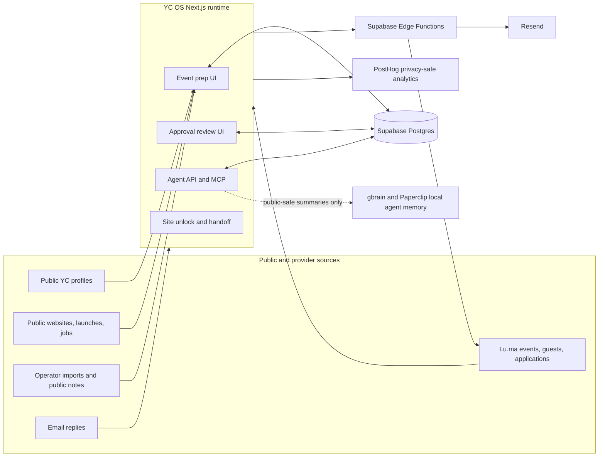
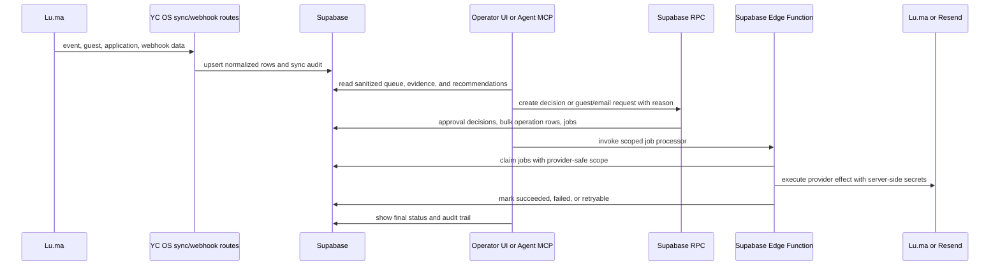
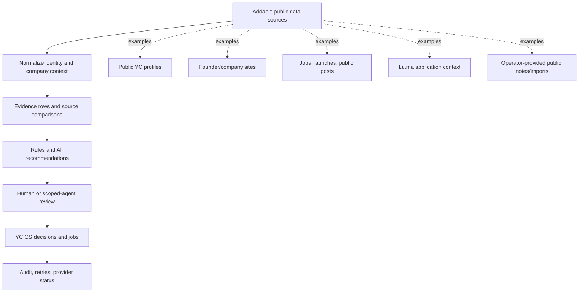

# YC OS

YC OS is a public-by-default operator workspace for YC public-data event prep,
Lu.ma approval review, and agent-assisted operations.

Public GitHub: https://github.com/aleishio/matchbookhq

The app helps an authorized operator or scoped AI agent prepare founder intros,
review Lu.ma event applications, request more information, approve/reject guests,
and run provider writebacks through YC OS without exposing raw provider payloads,
server secrets, dashboards, shell access, or private data.

## Public-By-Default Rules

- Treat this repository as public, even before it is open sourced.
- Commit only `.env.example`, never `.env`, `.env.local`, provider keys, tokens,
  service-role keys, cookies, logs, or raw payload exports.
- Use public or synthetic data only.
- Store source URLs, retrieval timestamps, and import script/version metadata for
  imported public data.
- Keep production secrets in Vercel, Supabase function secrets, or local env
  files outside the repo.
- Sanitize agent responses, analytics, logs, screenshots, PRs, and docs.

## What YC OS Does

- **Event prep:** imports public YC company/founder context, founder needs,
  public websites, launches, and job-post context into event-ready records.
- **Approval review:** syncs Lu.ma event applications into Supabase, normalizes
  applicants, enriches evidence, and gives operators a review queue.
- **Provider writebacks:** records decisions in YC OS first, then executes Lu.ma
  approvals/rejections, guest requests, and Resend clarification emails through
  server-side jobs/functions.
- **Agent handoff:** exposes a scoped MCP and JSON API so Claude, Codex,
  OpenClaw, Cursor, Paperclip, or another MCP-capable agent can use the same
  app tools as an operator.
- **Audit trail:** keeps sync runs, decisions, bulk operations, writeback jobs,
  clarification jobs, and provider webhook records in Supabase.

## Architecture



Core rule: operators and agents call YC OS. YC OS owns persistence, rules,
idempotency, provider secrets, writeback jobs, and audit rows.

## Approval And Writeback Flow



Agent writes are live by default when a valid unlock bearer token and a reason
are supplied. Production rejects `execute=false`; omit `execute` or set it to
`true` for live writes. Guest-add actions are capped at 10 guests per request and `sendEmail`
stays false unless the workflow explicitly allows email.

## Data And Evidence Model



New sources should plug in before evidence rules: fetch public data, store source
metadata, normalize it, generate evidence/comparison rows, then let review rules
and AI recommendations consume those rows. Do not feed raw private payloads
directly into agent prompts, logs, or analytics.

## Diagram Set

Use the five selected diagrams in `public/technical-diagrams/` for public docs.
Older draft variants are intentionally excluded from docs.


## Tools We Use

| Tool | Role | Open-source / secret policy |
| --- | --- | --- |
| Next.js | App runtime, routes, server actions, production build | No secrets in client components or `NEXT_PUBLIC_*` unless browser-safe |
| React | Operator UI | Mask or avoid private text in analytics/session capture |
| TypeScript | Type safety for app, API, and tests | Run `npm run typecheck` before shipping code changes |
| Bun | Test runner and TypeScript seed scripts | Local tool only |
| Vercel | Preview and production hosting | Tokens and project secrets live in Vercel/local env only |
| Supabase Postgres | Durable app state, approvals, sync state, jobs, audit rows | Service-role key is server-only |
| Supabase Edge Functions | Provider writebacks and bounded workers | Function secrets stay in Supabase function env |
| Lu.ma | Event source, applications, guests, webhooks, writebacks | API key and webhook secret are server-only |
| Resend | Clarification emails and inbound reply webhooks | API key and webhook secret are server-only |
| PostHog | Product analytics and optional masked recordings | Project token may be browser-visible; never send private text |
| OpenAI | Optional structured email draft/reply assistance | API key is server-only |
| Voyage | Embeddings for gbrain | API key is local/server-only |
| MCP | Agent tool protocol | Expose only allowlisted YC OS tools |
| gbrain | Shared project memory/search | Store concise public-safe summaries only |
| Paperclip | Multi-agent orchestration | Local/project config only; no production secrets in prompts |
| gstack | Review, QA, browser testing, ship, CSO/security workflows | Developer workflow tool, not app runtime |
| Mermaid | Text diagrams in docs | Keep diagrams source-controlled and public-safe |

## App And API Surface

### Operator Routes

- Event prep dashboard and event context views.
- Approval queue, event application review, dossiers, and bulk action flows.
- AI-agent handoff docs at `/approvals/integrations#ai-agent-docs`.

### Server Routes

| Route | Purpose | Access model |
| --- | --- | --- |
| `POST /api/unlock` | Private-site unlock | Site unlock token, rate limited |
| `POST /api/agent/sessions` | Browser handoff after unlock | Site unlock token |
| `GET /api/agent/capabilities` | List scoped tool/actions | Site unlock bearer token |
| `POST /api/agent/tools/call` | Call one YC OS agent tool | Site unlock bearer token |
| `POST /api/mcp` | MCP Streamable HTTP endpoint | Site unlock bearer token |
| `GET /api/event-prep` | Event-prep context | App route |
| `GET /api/event-prep/events` | Event-prep event list | App route |
| `GET /api/approvals/events` | Approval event list | App route |
| `GET /api/events/:eventId/approvals` | Event approval queue | App route |
| `POST /api/events/:eventId/approvals/bulk` | Bulk approve/reject/waitlist/info actions | App route, writes through Supabase |
| `POST /api/events/:eventId/approvals/email-draft` | Draft clarification copy | Server-side AI key if configured |
| `GET /api/approvals/:applicationId/dossier` | Review dossier | App route |
| `POST /api/luma/sync` | Signed scheduled Lu.ma sync | Cron/shared secret |
| `POST /api/luma/webhook` | Lu.ma webhook receiver | Lu.ma signature |
| `POST /api/luma/writebacks` | Signed retry/watchdog writeback drain | Cron/shared secret |
| `POST /api/agent/actions/luma-guests` | Guarded YC OS guest request action | Agent token |
| `POST /api/agent/guest-requests/process` | Signed guest-request worker | Cron/shared secret |
| `POST /api/resend/clarification-emails` | Signed clarification email worker | Cron/shared secret |
| `POST /api/resend/webhook` | Resend inbound reply webhook | Resend signature/secret |

## Agent Access

The agent surface is a first-class app API, not a direct provider export.

- The bearer token is the site unlock token, not a server secret.
- Agents start with `GET /api/agent/capabilities`, then use `/api/mcp` or
  `POST /api/agent/tools/call`.
- Agents receive sanitized app data, not raw Lu.ma payloads, private contact
  fields, cookies, service-role keys, provider secrets, shell, DB, GitHub, or
  deploy access.
- Provider effects run through YC OS records, Supabase RPCs, jobs, and Edge
  Functions. Agents do not call Lu.ma, Resend, Supabase service-role APIs, or
  dashboards directly.
- Reports should include page URL, event/filter, tool/action, live
  result, and next operator decision. Do not paste tokens, names, emails, phone
  numbers, reasons, or raw payloads into PRs or logs.

### Agent Read Tools

- `get_agent_guide`
- `get_event_prep_context`
- `list_event_prep_events`
- `search_founders`
- `list_approval_events`
- `list_approval_queue`
- `get_approval_summary`
- `get_guest_context`

### Agent Write Tools

- `create_event`
- `add_event_attendees`
- `enrich_event_context`
- `add_event_guests`
- `approve_applications`
- `reject_applications`
- `request_application_info`

## Local Development

Install dependencies:

```bash
npm install
```

Run the app:

```bash
npm run dev
```

Run checks:

```bash
npm run typecheck
npm test
npm run build
```

Local dev values must live outside this repo. The repo only keeps placeholders
in `.env.example`.

### Public Browser-Safe Values

- `NEXT_PUBLIC_APP_ENV`
- `NEXT_PUBLIC_APP_NAME`
- `NEXT_PUBLIC_DATA_CLASSIFICATION`
- `NEXT_PUBLIC_SUPABASE_URL`
- `NEXT_PUBLIC_SUPABASE_PUBLISHABLE_KEY`
- `NEXT_PUBLIC_POSTHOG_ENABLED`
- `NEXT_PUBLIC_POSTHOG_PROJECT_TOKEN`
- `NEXT_PUBLIC_POSTHOG_HOST`
- `NEXT_PUBLIC_POSTHOG_UI_HOST`
- `NEXT_PUBLIC_POSTHOG_RECORDINGS_ENABLED`

### Server-Only Values

- `SUPABASE_URL`
- `SUPABASE_SERVICE_ROLE_KEY`
- `RESEND_API_KEY`
- `RESEND_WEBHOOK_SECRET`
- `LUMA_API_KEY`
- `LUMA_WEBHOOK_SECRET`
- `LUMA_SYNC_SECRET`
- `OPENAI_API_KEY`
- `VOYAGE_API_KEY`
- `GBRAIN_SUPABASE_POOLER_URL`
- `YC_OS_ACCESS_TOKEN`
- Vercel project/deploy tokens

Do not prefix server-only keys with `NEXT_PUBLIC_`.

## Supabase Seeding

Event-prep and approval demo data should live in Supabase for
preview/prod-style flows. After migrations are applied and server-only Supabase
env vars are loaded, seed the current public YC event-prep data with:

```bash
npm run seed:prep:supabase
```

Seed the synthetic Lu.ma approval data with:

```bash
npm run seed:approvals:supabase
```

Use `-- --dry-run` with either seed command to print counts without writing.
The prep seed is idempotent for deterministic YC public-data IDs. The approval
seed is idempotent for the demo Lu.ma account. JSON data stays as a local
fallback/source fixture only.

## Deployment

Recommended flow:

```text
branch -> PR -> Vercel preview -> merge -> Vercel production deploy
```

Production requirements:

- Configure server-only env vars in Vercel and Supabase function secrets.
- Keep `EVENT_APPROVALS_DATA_SOURCE=supabase` for production-style approval
  flows.
- Deploy `supabase/functions/luma-writebacks`,
  `supabase/functions/agent-guest-requests`, and
  `supabase/functions/clarification-emails`.
- Run one non-critical Lu.ma sync, approval writeback, guest request, and
  clarification email in preview before enabling production traffic.
- Watch queue counts for failed/stale `luma_writeback_jobs`,
  `clarification_email_jobs`, and guest-request jobs.

## Security And Public Data

This repository is public. Keep production data and credentials out of git:

- Commit `.env.example` only. Real `.env*` files, logs, screenshots, provider
  exports, local tool state, and raw payload dumps must stay ignored.
- Store production secrets in Vercel environment variables and Supabase function
  secrets, not in source files or public docs.
- Keep `data/` limited to public YC context, synthetic examples, and sanitized
  fixtures. Do not commit authenticated Lu.ma payloads, private notes,
  non-public contact fields, or copied admin-page content.
- Agent responses, analytics, PR text, and docs must summarize operational
  results without exposing bearer tokens, service-role keys, provider keys, raw
  payloads, or private customer data.
- If a real secret or private payload ever lands in git, rotate the value and
  remove the exposure before deploying.

Maintainer checks before release:

```bash
npm test
npm run typecheck
npm run build
npm audit --audit-level=moderate
```

## Docs

- `DESIGN.md` - canonical UI and product design principles.
- `AGENTS.md` - repository instructions for coding agents.
- `CLAUDE.md` - project guardrails and skill-routing context for agents.
- `docs/design-system.md` - concrete layout, component, color, and browser QA
  rules.
- `docs/public-data-policy.md` - public data and analytics privacy policy.
- `docs/data-import.md` - public YC data import notes.
- `docs/supabase-backend-integration.md` - backend migration and approvals plan.
- `docs/technical-diagrams.md` - selected public diagram set.
- `docs/luma-sync-architecture.md` - Lu.ma, Supabase, webhook, and writeback
  architecture.
- `docs/gbrain-paperclip.md` - local gbrain and Paperclip setup policy.
- `docs/browser-qa-alternatives.md` - local gstack browser override and longer
  term QA paths.

## Shared Brain

Use the Supabase Session Pooler URL for gbrain, not the direct database URL.

Local values live outside the repo:

```text
VOYAGE_API_KEY
GBRAIN_SUPABASE_POOLER_URL
```

Check local setup with:

```text
gbrain doctor
```

gbrain is shared project memory, not a raw transcript recorder. Store concise
public-safe summaries only.
