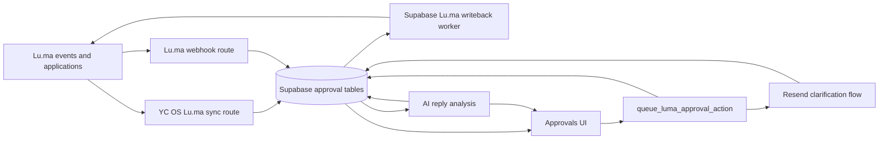
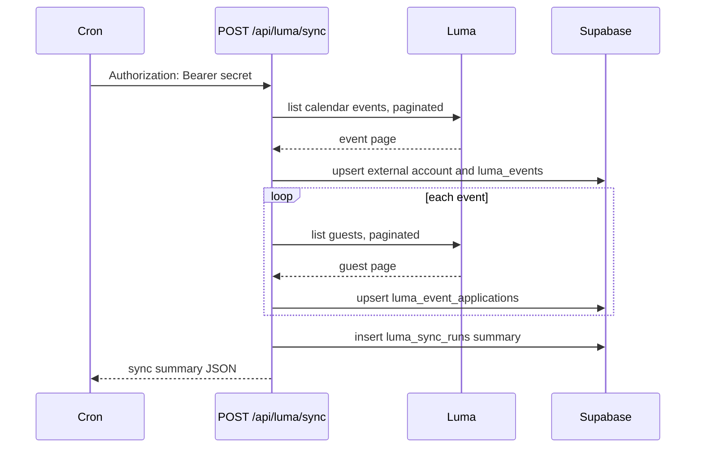
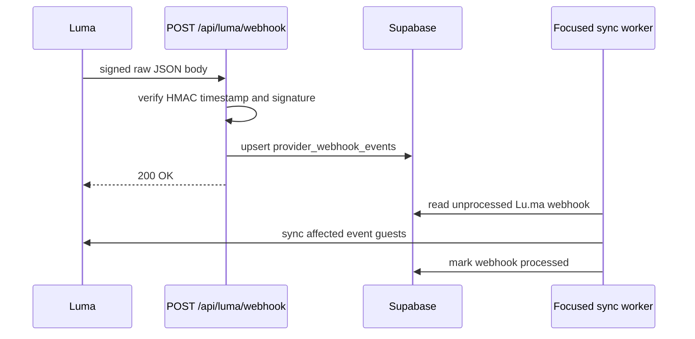

# Lu.ma Sync Architecture

Date: 2026-06-09

This document covers the agent-native and UI path for YC OS event approvals.
Lu.ma remains the source of event/application data and provider status.
Supabase is the YC OS review system of record. Writes back to Lu.ma happen only
after an authorized user or agent triggers a guarded YC OS action.

For the polished "what was built" diagram set, start with
`docs/technical-diagrams.md`. That document selects the five diagrams that
should be used in public/project docs and leaves the older draft variants out.

Reference: Lu.ma's webhook documentation describes the `Webhook-Signature`,
`Webhook-Id`, and `Webhook-Timestamp` headers, HMAC-SHA256 verification, retry
behavior, and duplicate-delivery expectations:
`https://help.luma.com/p/webhooks`.

## Configuration

Local development uses `.env.local` or the shared local secret file. Preview and
production should use server-only environment variables.

Required for sync and writeback:

```text
EVENT_APPROVALS_DATA_SOURCE=supabase
SUPABASE_URL=
SUPABASE_SERVICE_ROLE_KEY=
LUMA_API_KEY=
LUMA_SYNC_SECRET=
```

Optional immediate-writeback controls:

```text
LUMA_WRITEBACK_WORKER_URL=
LUMA_WRITEBACK_WORKER_STRATEGY=supabase
LUMA_IMMEDIATE_WRITEBACK_BATCH_SIZE=20
```

Use a small immediate batch size. Supabase Edge Functions are bounded
serverless workers, not unbounded queue daemons: current platform limits include
256 MB memory, short CPU budgets, and a wall-clock window measured in minutes
(150 seconds on free plans, 400 seconds on paid plans). The approval action path
should therefore process only the jobs created by that action and leave larger
or delayed work to the retry/watchdog route.

Required for Lu.ma webhooks:

```text
LUMA_WEBHOOK_SECRET=
```

Optional rate and batch controls:

```text
LUMA_SYNC_EVENT_PAGE_LIMIT=50
LUMA_SYNC_GUEST_PAGE_LIMIT=100
LUMA_SYNC_REQUEST_SPACING_MS=250
LUMA_WRITEBACK_BATCH_SIZE=20
LUMA_IMMEDIATE_WRITEBACK_BATCH_SIZE=20
AGENT_GUEST_REQUEST_BATCH_SIZE=10
```

`POST /api/luma/sync`, the signed watchdog routes, and the Supabase provider
Edge Functions accept a server action secret. Next.js routes accept either
`Authorization: Bearer $LUMA_SYNC_SECRET` or `x-cron-secret:
$LUMA_SYNC_SECRET`. Supabase functions are invoked with the Supabase service
role JWT for the Functions gateway and validate `x-cron-secret` inside the
function. If `LUMA_SYNC_SECRET` is not set, the shared `CRON_SECRET` or
`WEBHOOK_SECRET` can be used.

## System Boundary



## Scheduled Sync

Scheduled sync is the completeness path. It should run even when webhooks are
enabled because webhook delivery can be delayed, duplicated, or temporarily
disabled.



Sync behavior:

- Requests are sequential and paced by `LUMA_SYNC_REQUEST_SPACING_MS`.
- The Lu.ma client retries 429 and 5xx responses and honors `Retry-After`.
- Raw Lu.ma event and guest payloads are preserved in `raw_payload` and
  `luma_payload`.
- Existing YC OS decisions are preserved when Lu.ma is still
  `pending_approval`, so a sync race does not undo a just-approved row before
  the writeback worker runs.
- If Lu.ma later reports `approved`, `declined`, or `waitlist`, provider status
  wins and the YC OS row moves to `approved`, `rejected`, or `waitlist`.

## Lu.ma Webhooks

Webhooks are the freshness path. They should record provider events and trigger
a focused sync for the changed event. The current route verifies and records the
event; a follow-up worker can consume `provider_webhook_events` to run event-only
sync.



Webhook safety:

- Signature verification uses the raw request body, timestamp tolerance, and
  `timingSafeEqual`.
- Duplicate webhook IDs are ignored through a provider/provider event id
  upsert.
- Webhook payloads are stored before derived processing so failures can be
  replayed.
- Unknown event types are stored but do not automatically trigger sync.

## Agent And User Actions

The UI and external agents share the same operating model: call YC OS tools or
routes, record intent in Supabase, then let the YC OS runtime execute provider
effects with server-side secrets. Agents should be able to run the approval
workflow end to end through MCP tools; they should not need Lu.ma dashboard/API,
Supabase service-role, shell, or deployment access.

Select-all UI actions call the YC OS bulk API, which delegates to the Supabase
RPC. Agent actions call the MCP tools (`approve_applications`,
`reject_applications`, and `request_application_info`), which use the same bulk
operation path.

```mermaid
sequenceDiagram
  participant Actor as UI or Agent MCP tool
  participant Bulk as POST /api/events/:id/approvals/bulk
  participant RPC as queue_luma_approval_action
  participant DB as Supabase
  participant Worker as Supabase luma-writebacks function
  participant Luma

  Actor->>Bulk: approve/reject/send_info/waitlist selected rows
  Bulk->>RPC: application ids, action, actor, filter payload, optional email copy
  RPC->>DB: approval_bulk_operations
  RPC->>DB: approval_decisions
  RPC->>DB: update luma_event_applications
  alt approve or reject
    RPC->>DB: luma_writeback_jobs
    Bulk->>Worker: invoke scoped operation
    Worker->>DB: claim_luma_writeback_jobs with SKIP LOCKED
    Worker->>Luma: update guest status by api_id or email
    Worker->>DB: mark succeeded or failed with retry time
  else send_info
    RPC->>DB: clarification_email_jobs with queued subject/body
  end
```

Decision rules in the first backend pass:

- Approve only applies to `ready` applications.
- Reject applies to any non-final application.
- Send-info applies to `needs_info` and `manual` applications with an email.
- Send-info can include user-authored subject/body copy. The default template is
  still used when no custom copy is provided.
- Waitlist applies to `ready`, `manual`, and `needs_info`.
- AI recommendations are evidence, not authority. They can make a row ready for
  human selection, but they do not write to Lu.ma by themselves.

Agent-native execution rule:

- The normal approve/reject path, whether triggered by UI or agent MCP, should
  invoke the Supabase `luma-writebacks` Edge Function for the newly created bulk
  operation scope.
- The legacy `POST /api/luma/writebacks` route remains a signed retry/watchdog
  endpoint and local fallback, not the product-facing primary path.
- Agents own the workflow through YC OS tools. Server-side functions own
  secrets, raw provider payloads, idempotency, retries, and audit.

## Supabase Edge Function Considerations

The Supabase Edge Function is a good fit for this path because it keeps Lu.ma
secrets server-side, runs close to the database when region-pinned, and can
return a scoped result to the UI quickly. It should stay intentionally small.

Operational constraints:

- Runtime limits: Supabase currently documents 256 MB memory, 150 second request
  idle timeout, and finite wall-clock runtime. Keep immediate writebacks scoped
  to one bulk operation and cap `LUMA_IMMEDIATE_WRITEBACK_BATCH_SIZE`.
- CPU limits: Edge Functions are best for I/O-bound provider calls. Avoid
  expensive matching, AI review, or large JSON transformation in this function.
- Cold starts: rare actions may pay cold-start latency. The UI should show
  optimistic human-facing final states and rely on job status for retries.
- Region: invoke the function in the same Supabase region as the database when
  possible, because each job needs database claim/update calls.
- Background tasks: `EdgeRuntime.waitUntil` can be used for fire-and-forget
  retries, but the interactive approve/reject path should usually wait for the
  scoped result so the operator sees `Approved in Lu.ma` or `Declined in Lu.ma`.
- Idempotency: never call Lu.ma directly from a database trigger. The database
  should create durable jobs; workers should claim with `FOR UPDATE SKIP LOCKED`
  and mark success/failure.
- Runtime boundary: approve/reject immediate writebacks should invoke the
  Supabase Edge Function. If that function is missing or unhealthy, surface the
  job as queued/retrying/not configured; do not silently call Lu.ma from the
  product-facing Next runtime. The signed Next route remains for watchdog/manual
  retries, and `LUMA_WRITEBACK_WORKER_STRATEGY=next` is only a non-production
  local development override.
- Observability: monitor `luma_writeback_jobs` counts by `status`,
  `attempt_count`, `scheduled_at`, `locked_at`, and `last_error`. A growing
  `failed` or old `running` set means the watchdog route or manual inspection
  should run.
- Secrets: keep `SUPABASE_SERVICE_ROLE_KEY`, `LUMA_API_KEY`, and
  `LUMA_SYNC_SECRET` in server/Edge Function environments only. They must never
  appear in browser config or logged payloads.

References:

- Supabase Edge Function limits:
  `https://supabase.com/docs/guides/functions/limits`
- Supabase background tasks:
  `https://supabase.com/docs/guides/functions/background-tasks`
- Supabase regional invocation:
  `https://supabase.com/docs/guides/functions/regional-invocation`

## Data Tables

Core sync:

- `external_accounts`
- `luma_events`
- `luma_event_applications`
- `luma_sync_runs`
- `provider_webhook_events`

Review evidence:

- `applicant_identity_matches`
- `applicant_source_comparisons`
- `applicant_ai_reviews`

Actions and external jobs:

- `approval_decisions`
- `approval_bulk_operations`
- `approval_bulk_operation_items`
- `luma_writeback_jobs`
- `clarification_email_jobs`
- `applicant_replies`

## Edge Cases

- Duplicate scheduled sync: upserts on external account, event id, and guest id
  make repeated sync idempotent.
- Duplicate webhook: provider event id upsert avoids replaying the same event
  row.
- Lu.ma rate limit: client retries 429 with `Retry-After`; sync also spaces
  requests.
- Writeback race: local approved/rejected/awaiting-reply states are preserved
  while Lu.ma remains pending.
- External status change: if Lu.ma has already approved, declined, or waitlisted
  a guest, the next sync updates YC OS to match the provider.
- Missing guest API id: writebacks use `guest_api_id` when present and fall back
  to applicant email. If neither exists, the job fails safely and remains
  visible for manual review.
- Multiple workers: `claim_luma_writeback_jobs` uses `FOR UPDATE SKIP LOCKED`
  and per-job locks.
- Scoped immediate worker: approve/reject calls pass the bulk operation id so
  one user action cannot drain unrelated queued jobs.
- Partial bulk action: the RPC writes skipped items into
  `approval_bulk_operation_items` with the reason.
- Missing service secrets: server routes fail closed with 500 configuration
  errors instead of exposing provider keys to the browser.

## Rollout

1. Apply `202606090001_event_approvals_foundation.sql`.
2. Apply `202606090002_luma_sync_operations.sql`.
3. Configure server-only env vars.
4. Run `POST /api/luma/sync` once in preview and inspect `luma_sync_runs`.
5. Switch `EVENT_APPROVALS_DATA_SOURCE=supabase` for preview.
6. Deploy `supabase/functions/luma-writebacks`,
   `supabase/functions/agent-guest-requests`, and
   `supabase/functions/clarification-emails`.
7. Keep worker strategies set to `supabase` or unset in production so immediate
   UI/MCP provider effects use Supabase functions.
8. Test one approve/reject writeback, one operator-email guest-add request, and
   one clarification email against non-critical records.
9. Enable scheduled sync, webhooks, and watchdog drains.
10. Enable production after ops verifies queue counts and provider-effect
    behavior.
