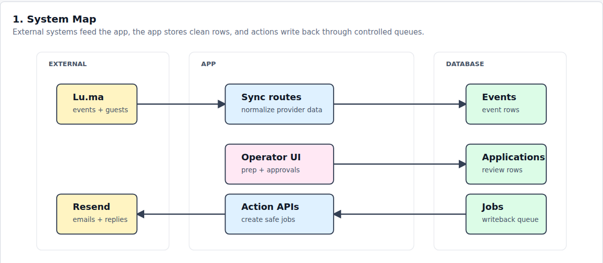
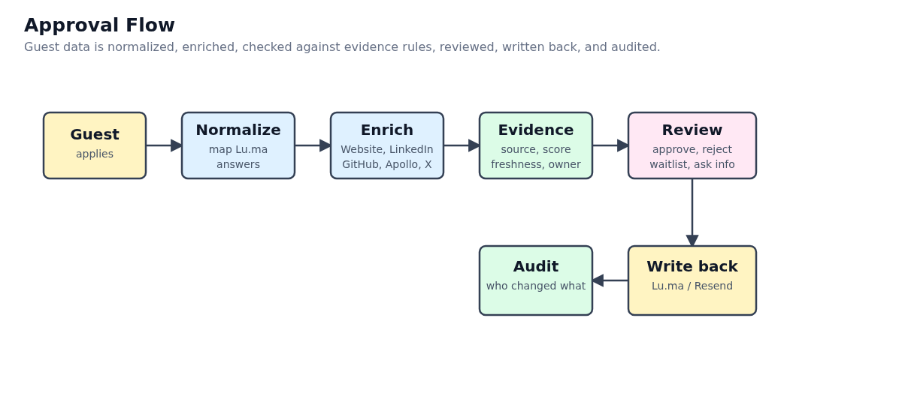
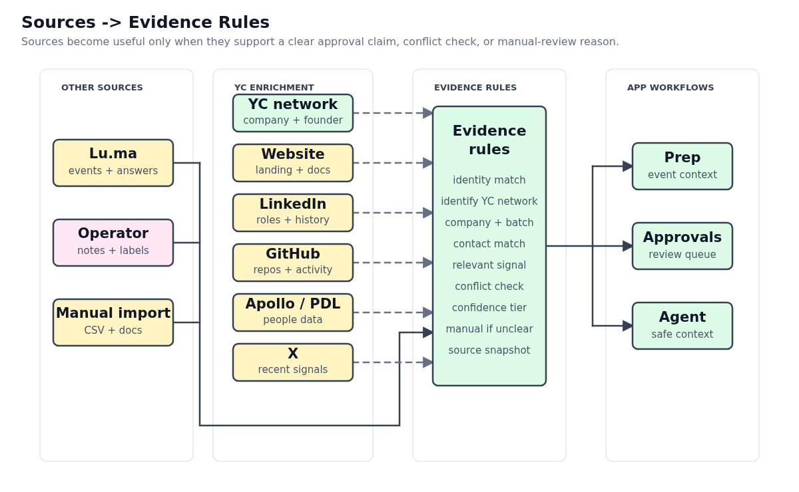
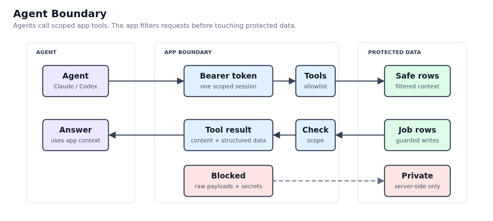
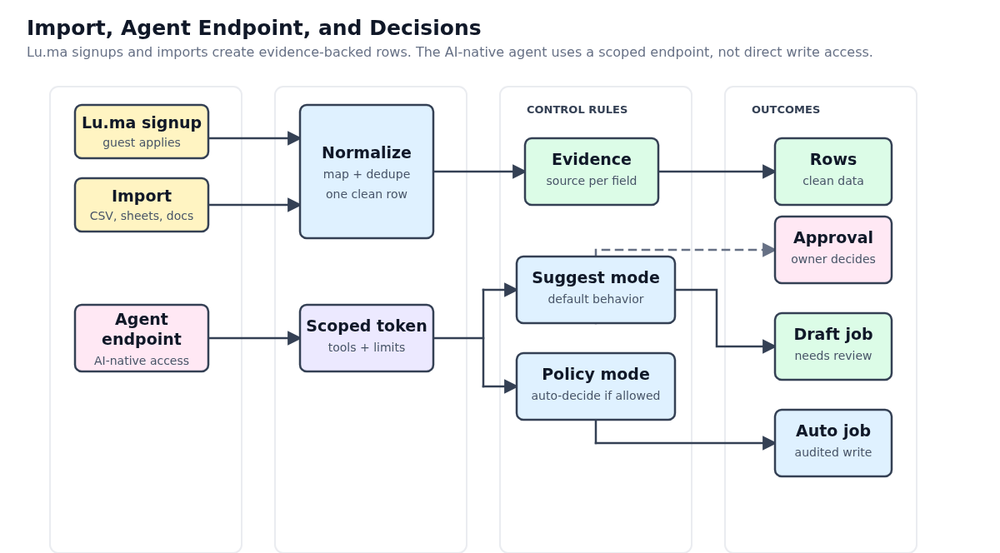

# Technical Diagrams

Date: 2026-06-12

This is the diagram set that should replace the old dense "How built" system
diagram. Keep the public docs to the five selected diagrams below. They explain
the project in the right order: system, approval flow, data evidence, agent
boundary, and Lu.ma/import/agent endpoint.

## Recommended For Docs

1. System map

   Use first. It explains the app shape: external providers, app runtime, and
   Supabase data.

   

2. Approval flow with enrichment

   Use for the main approval workflow. It shows guest application, normalize,
   enrich, evidence, review, audit, and writeback.

   

3. Sources to evidence rules

   Use for data-source and enrichment docs. It keeps Lu.ma, operator notes,
   manual import, YC network, Website, LinkedIn, GitHub, Apollo/PDL, and X
   separate from the evidence rules.

   

4. Agent boundary

   Use in the AI agent docs. It explains the scoped bearer token, allowlisted
   tools, filtered rows, guarded jobs, and blocked raw/private data.

   

5. Lu.ma signup, import, and agent endpoint

   Use last. It clarifies that Lu.ma signup is the primary entry path, import is
   a secondary entry path, and the AI-native agent uses a scoped endpoint.

   

## Leave Out Of Docs

These older files were drafts or superseded variants from the diagram iteration:

- `01-what-the-app-is.png`
- `02-approval-flow.png`
- `03-agent-access.png`
- `03-agent-boundary.png`
- `03-data-sources.png`
- `03-data-sources-enrichment.png`
- `matchbookhq-technical-diagrams.png`
- `matchbookhq-technical-diagrams.pdf`

They are useful only as iteration history. The current docs should use the five
files in `public/technical-diagrams/`.
